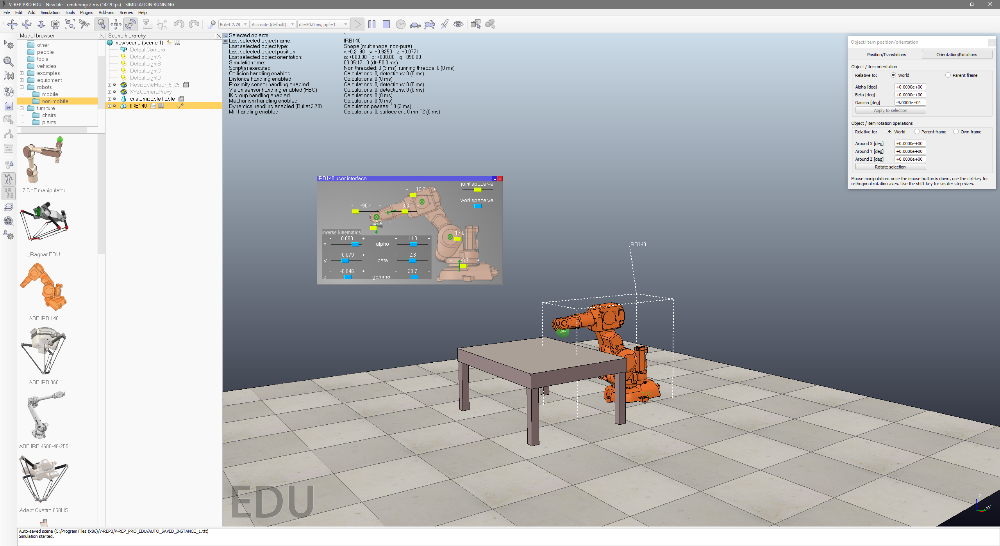
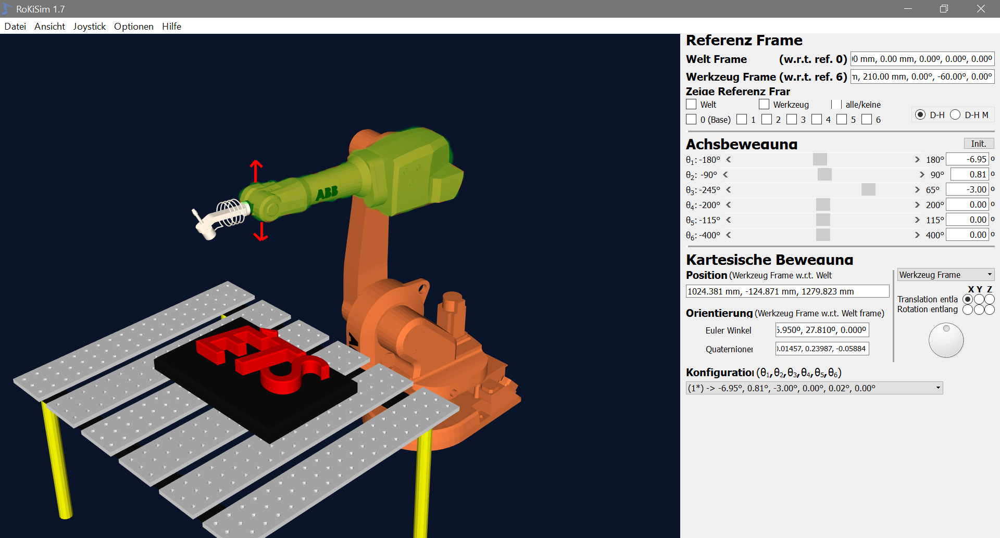
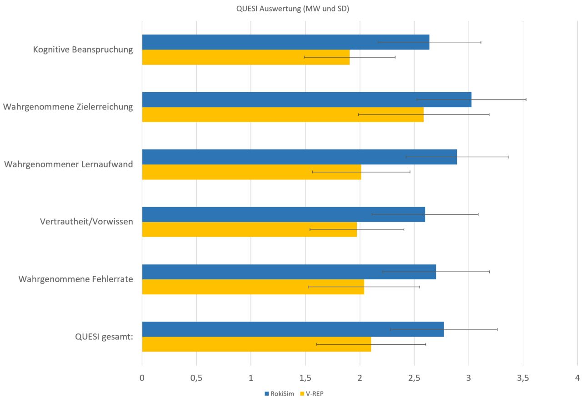

# Usability comparison of two robot simulation softwares
A Comparative Study to evaluate the usability of two industrial robot simulation softwares.

## Method

In a university project we compared two different softwares for industrial robot simulation regarding their usability. We first conducted coginitive walkthroughs with several experts and then tested 25 participants how good the tools can be learned by beginners.

In order to do that we created different tasks to be executed by the participants. We then used different quantitative measures (Eye Tracking and different Questionnaires) and qualitative measures.

Sample of Results (QUESI questionnaire):

While evaluating the results we saw that our hypothesis that we created from the initial cognitive walkthroughs was not correct and that the other software is better usable for beginners in this field.
